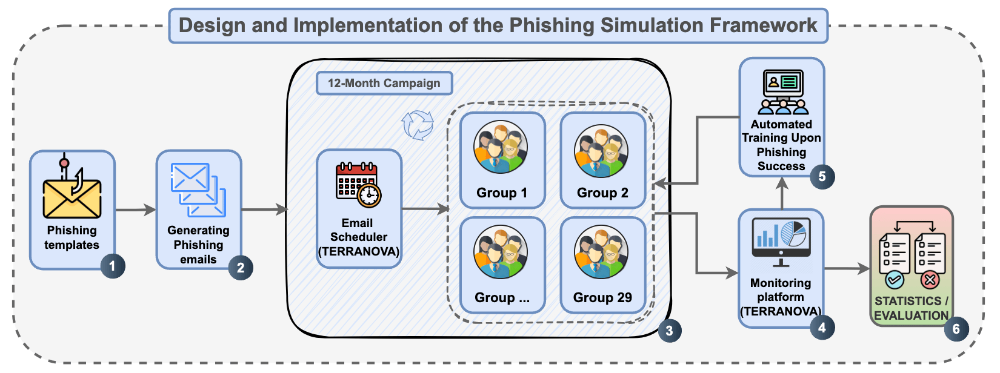
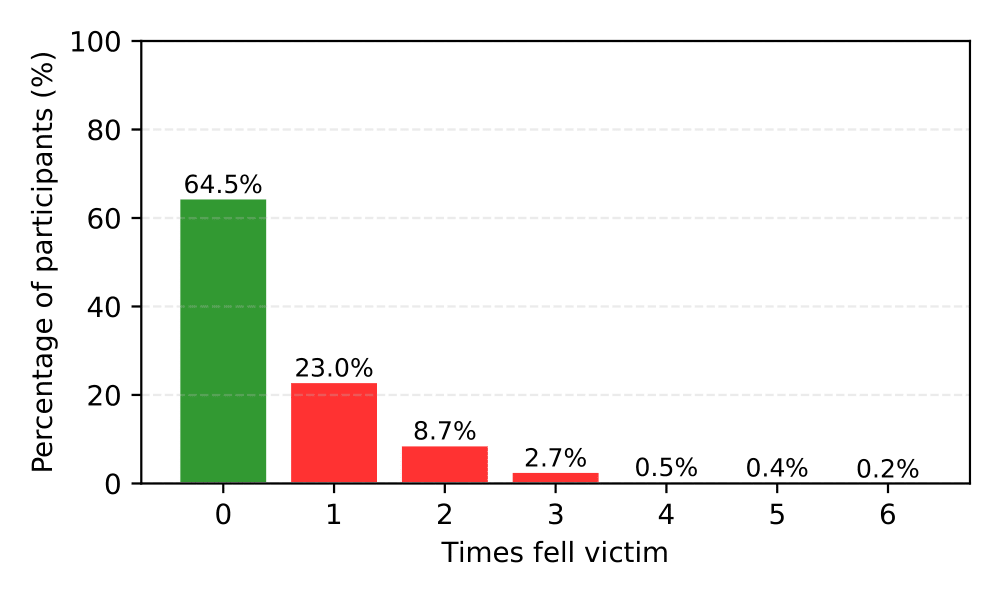
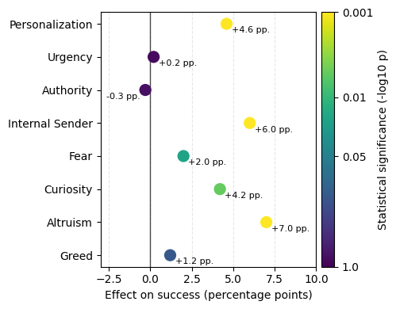

# Corporate Phishing Study

  

<h1 align="center">Corporate Phishing Study</h1>

A comprehensive open-science dataset and analytical framework for studying phishing susceptibility in real corporate environments. This repository accompanies the paper:

> **(2025). Understanding Emotional and Contextual Cues in Corporate Phishing Susceptibility: A Longitudinal Field Study.**

The dataset and analysis presented here capture one year of simulated phishing activity across over 1,300 employees and 20 subsidiaries of a European holding company. The study investigates how emotional manipulation, contextual framing, and training interventions influence real-world employee behavior.

## Overview

This repository provides:

* **Templates:** The full set of **31 phishing email templates** annotated with emotional and contextual cues (e.g., fear, curiosity, altruism, greed, personalization, authority, urgency).
* **Paper:** The complete research article in LaTeX format.

The study was conducted entirely within a legitimate corporate awareness program, under GDPR-compliant ethical standards.

## Abstract

Phishing constitutes more than 90\% of successful cyberattacks globally, remaining one of the most persistent threats to organizational security. Despite organizations tripling their cybersecurity budgets between 2015 and 2025, the human factor continues to pose a critical vulnerability. This study presents a 12-month longitudinal investigation into how continuous cybersecurity training and emotional cues affect employee susceptibility to phishing. The experiment involved 20 organizations and over 1,300 employees who collectively received 13,000 simulated phishing emails engineered with diverse emotional, contextual, and structural characteristics. Behavioral responses were analyzed using non-parametric correlation and regression models to assess the influence of psychological manipulation, message personalization, and perceived email source. Results demonstrate that sustained phishing simulations and targeted training programs lead to a significant reduction in employee susceptibility—nearly halving successful compromise rates within three months. Emotional framing notably shapes response patterns: altruistic cues elicit the highest engagement, whereas urgency cues slightly reduce susceptibility. Additionally, employee turnover introduces measurable fluctuations in awareness levels, underscoring the necessity of maintaining continuous training initiatives. These findings provide one of the few long-term perspectives on phishing awareness efficacy, highlighting the strategic importance of ongoing behavioral interventions in strengthening organizational cyber resilience. In our ongoing efforts to support open science, we published our email templates and other materials at 

## Methodology

  

The study was conducted using a structured, six-phase phishing simulation framework, as shown above.

1. **Generating Phishing Emails** — 31 unique phishing templates were developed using the *Psychological Impact of Cyberattacks Model*, each annotated with emotional and contextual cues (e.g., fear, curiosity, altruism, greed, personalization, urgency, authority).

2. **Email Scheduler (Terranova Module)** — Emails were automatically distributed using the Terranova platform, ensuring controlled delivery and tracking across all participating subsidiaries.

3. **Group Assignment** — Participants were randomly divided into 30 balanced groups to prevent inter-departmental coordination or forewarning during the phishing campaigns.

4. **12-Month Campaign Execution** — Phishing simulations were run continuously throughout 2024, with each employee receiving one phishing email per month during business hours.

5. **Automated Training Upon Phishing Success** — Employees who interacted unsafely with a phishing email received immediate feedback and were required to complete a short corrective awareness module.

6. **Statistics and Evaluation** — Behavioral data were aggregated and analyzed using Python and IBM SPSS Statistics 23. Non-parametric tests (Spearman’s rank correlation, Bonferroni correction) were applied to assess the relationship between emotional cues and phishing success.

## Key Findings

  

1. **Training Effect Over Time**  
   Phishing susceptibility declined from **8.5% to 4.2%** over 12 months — nearly halving unsafe actions within six months.  
   The lowest failure rate (2.8%) occurred during the summer vacation period, reflecting reduced activity.  
   By the final quarter, results stabilized around the **industry average of 4.1%**, confirming a strong long-term training effect.

---

  

2. **Distribution of Unsafe Actions**  
   Around **64.5% of participants never clicked**, while **23% failed once** and only **0.2%** failed more than six times.  
   Most employees who failed once did not repeat unsafe behavior, indicating **rapid behavioral improvement** after feedback.

---

  

3. **Effect of Emotional and Contextual Cues**  
   *Altruistic*, *internal-source*, and *personalized* phishing emails produced the highest response rates.  
   Traditional cues like *urgency* and *authority* showed little or no effect, suggesting **user habituation**.  
   Combining multiple cues (e.g., internal + altruism + personalization) increased success probability up to **3.7×** compared to neutral messages.

